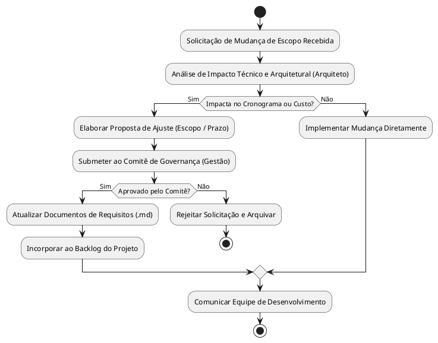

# Especificação de Escopo e Governança de Projeto
**Sistema:** HoraCerta — Gestão Escolar e Calendário de Eventos
**Padrão:** PMBOK 7ª Edição | OMG UML 2.5.1
**Versão:** 1.0
**Data:** 08/09/2026
---
**Professor:** Carlos David.
---
**Integrantes:** Arthur Augusto de Souza, Alexsandro Oliveira Carvalho, Gabriel Carezolin Borges, Luis Fernando Ferreira Maracaipes Campos, Misael Augusto de Oliveira Gomes e Vitor Gabriel da Costa.
---

## 1. Justificativa de Engenharia e Objetivos SMART

### 1.1 Justificativa de Engenharia
A descentralização das informações acadêmicas, imprevistos de última hora em horários escolares e a falta de visibilidade sobre substituições de aulas geram desorganização entre alunos e professores. A solução full-stack **HoraCerta** utiliza uma arquitetura leve (HTML5/Vanilla JS no frontend e Node.js/Express com SQLite/PostgreSQL no backend) para prover sincronização de calendários em tempo real com baixo custo operacional e alta performance.

### 1.2 Objetivos SMART
- **Específico (Specific)**: Desenvolver um sistema web completo de calendário escolar dinâmico com controle de acesso baseado em papéis (RBAC).
- **Mensurável (Measurable)**: Reduzir a zero o tempo de atraso na notificação de alterações de horários de aula e atingir tempo de resposta da API < 100ms.
- **Atingível (Achievable)**: Construir a solução com stack totalmente open-source, HTML5 semântico, JavaScript moderno e runtime Node.js sem frameworks de frontend pesados.
- **Relevante (Relevant)**: Eliminar os conflitos de horários em salas e quadras, aumentando a produtividade e a comunicação da escola.
- **Temporal (Time-bound)**: Concluir e implantar os 3 módulos do sistema (Autenticação, Calendário/Filtros e Gestão de Trocas) no prazo de 8 semanas.

---

## 2. Fronteira do Sistema e Diagrama de Contexto (PlantUML)

```plantuml
@startuml
skinparam packageStyle rectangle

actor "Usuário da Escola
(Aluno/Prof/Gestor)" as ActorUser
actor "Administrador Técnico" as ActorAdmin

rectangle "Fronteira do Sistema HoraCerta (System Boundary)" {
    component "Frontend Client-Side
(HTML5 / CSS3 / Vanilla JS ES6+)" as Frontend
    component "Backend Application Runtime
(Node.js / Express REST API)" as Backend
    database "Camada de Persistência
(PostgreSQL / SQLite)" as Database
}

node "Serviços Externos / CDN" {
    component "CDN de Bibliotecas
(Supabase JS / DOMPurify)" as CDN
}

ActorUser --> Frontend : Acessa via Navegador Web (HTTPS)
ActorAdmin --> Frontend : Acessa Painel Administrativo
Frontend --> CDN : Carrega SDKs dinâmicos
Frontend --> Backend : Comunicação REST Async (JSON / Fetch)
Backend --> Database : Consultas SQL Parametrizadas (Prepared Statements)
@enduml
```

---

## 3. Escopo do Produto e Entregáveis Físicos

O projeto está dividido em 3 módulos funcionais principais com seus respectivos artefatos de código-fonte:

| Módulo | Descrição do Módulo | Entregáveis Físicos de Código |
|---|---|---|
| **M01: Interface Frontend** | Interface responsiva, acesso visual por papel, alternância de tema e filtros em tempo real. | `index.html`<br>`style.css`<br>`app.js` |
| **M02: Servidor API Backend** | Servidor RESTful Node.js Express com controle de sessão, middlewares de segurança e validação. | `server.js`<br>`routes/auth.js`<br>`routes/eventos.js`<br>`middlewares/auth.js` |
| **M03: Banco de Dados** | Estrutura de tabelas relacionais, integridade referencial, índices e triggers de auditoria. | `schema.sql`<br>`database.js` |

---

## 4. Diagrama de Componentes (UML 2.5.1)

```plantuml
@startuml
package "Navegador Cliente (Frontend)" {
    [Interface HTML5 / CSS3] as UI
    [Controlador JavaScript (app.js)] as JSController
    UI - [JSController]
}

package "Servidor Node.js Application (Backend)" {
    portin "Porta HTTP 3000" as PortHTTP
    [Express Router] as Router
    [Auth Middleware] as AuthMW
    [Evento Controller] as EventoCtrl
    [Audit Service] as AuditSvc

    PortHTTP --> Router
    Router --> AuthMW
    AuthMW --> EventoCtrl
    EventoCtrl --> AuditSvc
}

database "Persistência (Database)" {
    [PostgreSQL / SQLite] as DB Engine
}

JSController ..> PortHTTP : Requisições HTTP REST (Fetch / JSON)
EventoCtrl ..> [DB Engine] : Prepared Queries (SQL)
@enduml
```

---

## 5. Diagrama de Implantação / Deployment (UML 2.5.1)

```plantuml
@startuml
node "Dispositivo Cliente" {
    node "Navegador Web (Chrome/Firefox/Safari)" {
        artifact "index.html"
        artifact "style.css"
        artifact "app.js"
    }
}

node "Servidor de Aplicação (Linux / Cloud Container)" {
    node "Node.js Runtime Engine (V8)" {
        artifact "server.js (Express)"
        artifact ".env (Variáveis de Ambiente)"
    }
}

node "Servidor de Banco de Dados" {
    database "PostgreSQL / SQLite Storage" {
        artifact "schema.sql (Tabelas e Índices)"
    }
}

Navegador Web -- Node.js Runtime Engine : HTTPS / REST API (Porta 443 -> 3000)
Node.js Runtime Engine -- PostgreSQL : TCP/IP Connection Pool (Porta 5432)
@enduml
```

---

## 6. Estrutura Analítica do Projeto (EAP / WBS) e Dicionário

### 6.1 EAP / WBS Textual Hierárquica
```text
1. PROJETO HORACERTA
   1.1 GERENCIAMENTO DO PROJETO
       1.1.1 Termo de Abertura e Declaração de Escopo
       1.1.2 Matriz de Riscos e Cronograma
   1.2 ENGENHARIA DE REQUISITOS E ARQUITETURA
       1.2.1 Especificação de Requisitos de Usuário (RU)
       1.2.2 Especificação de Requisitos de Sistema (RSF/RSNF)
       1.2.3 Modelagem UML 2.5.1
   1.3 DESENVOLVIMENTO FRONTEND
       1.3.1 Layout HTML5 Semântico e Tema CSS3 (Light/Dark)
       1.3.2 Lógica do Calendário e Filtros Dinâmicos em JS
   1.4 DESENVOLVIMENTO BACKEND E BANCO DE DADOS
       1.4.1 Modelagem DDL e Scripts SQL
       1.4.2 API REST Node.js com Express e JWT
   1.5 HOMOLOGAÇÃO E IMPLANTAÇÃO
       1.5.1 Testes de Integração e Segurança
       1.5.2 Deploy no GitHub Pages / Supabase / Cloud Host
```

---

## 7. Limites Explícitos do Projeto (In-Scope vs Out-of-Scope)

### ✅ Dentro do Escopo (In-Scope)
- Desenvolvimento da interface frontend em HTML5, CSS3 puro e JavaScript Vanilla.
- Filtros interativos de eventos no calendário via checkboxes.
- Alternância de tema diurno/noturno (Light/Dark Mode).
- Autenticação com perfis de acesso: Aluno, Professor, Gestor e Admin.
- Fluxo completo de solicitação e aprovação de substituição de aulas vagas.
- Banco de dados relacional com suporte a SQL parametrizado.

### ❌ Fora do Escopo (Out-of-Scope)
- Desenvolvimento de aplicativo nativo para iOS ou Android (foco estrito em Web Responsivo).
- Integração com sistemas legados de folha de pagamento de professores.
- Processamento de pagamentos ou mensalidades escolares.
- Transmissão de videoaulas ao vivo dentro da plataforma.

---

## 8. Matrizes de Aceitação, Riscos e Mitigações

### 8.1 Matriz de Riscos Técnicos e Mitigações
| Risco Técnico | Causa Raiz | Impacto | Plano de Mitigação Arquitetural |
|---|---|---|---|
| **Bloqueio do Event Loop** | Operações síncronas pesadas no Node.js | ALTO | Utilizar exclusivamente chamadas assíncronas (`async/await`) e delegação de tarefas pesadas para Worker Threads. |
| **Ataque de SQL Injection** | Concatenação direta de SQL | CRÍTICO | Uso compulsório de Prepared Statements (`$1, $2`) na camada de dados. |
| **Ataque de XSS** | Injeção de scripts no DOM | ALTO | Sanitização ativa de entradas com `DOMPurify` no frontend e `express-validator` no backend. |

---

## 9. Governança e Processo de Controle de Mudanças de Escopo


