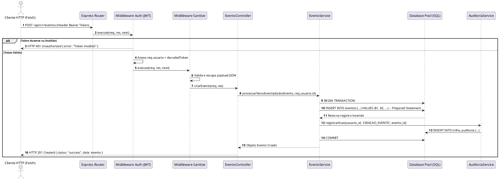
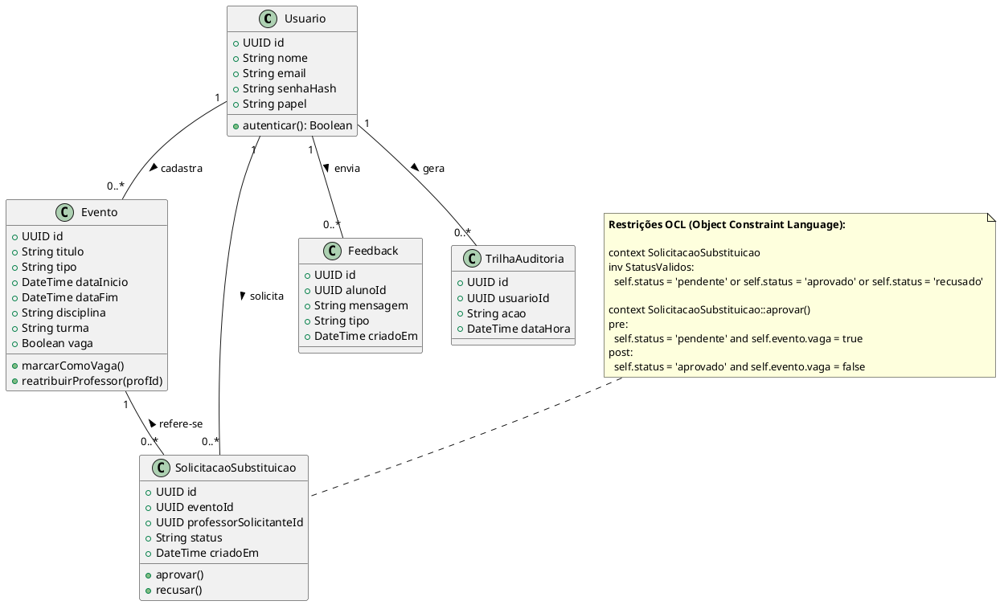

# Especificação de Requisitos de Sistema (RS)
**Sistema:** HoraCerta — Gestão Escolar e Calendário de Eventos
**Padrão:** FURPS+ / ISO/IEC 25010 | Node.js Runtime Architecture
**Versão:** 1.0
**Data:** 08/09/2026
**Professor:** Carlos David.
**Integrantes:** Arthur Augusto de Souza, Alexsandro Oliveira Carvalho, Gabriel Carezolin Borges, Luis Fernando Ferreira Maracaipes Campos, Misael Augusto de Oliveira Gomes e Vitor Gabriel da Costa.
---
---

## 1. Requisitos Funcionais de Sistema (RSF)

### `RSF-01`: Gerenciamento de Autenticação e Sessão REST
- **Rota HTTP**: `POST /api/v1/auth/login`
- **Acesso**: Público
- **Express Middlewares**: `express.json()`, `rateLimiter`, `loginSanitizer`
- **Payload Requisição JSON**:
  ```json
  {
    "email": "professor.carlos@escola.edu.br",
    "senha": "SenhaSecreta#2026",
    "papel": "professor"
  }
  ```
- **Respostas HTTP**:
  - `200 OK`: Credenciais válidas. Retorna o token JWT e o objeto do usuário.
    ```json
    {
      "status": "success",
      "token": "eyJhbGciOiJIUzI1NiIsInR5cCI6IkpXVCJ9...",
      "user": { "id": "uuid-1234", "nome": "Carlos Silva", "papel": "professor" }
    }
    ```
  - `400 Bad Request`: Payload malformado ou campos obrigatórios ausentes.
  - `401 Unauthorized`: Senha incorreta ou e-mail não encontrado.

### `RSF-02`: Consulta de Eventos do Calendário com Filtros
- **Rota HTTP**: `GET /api/v1/eventos`
- **Acesso**: Autenticado ou Público (Leitura)
- **Parâmetros Query**: `?mes=8&ano=2026&categorias=aula,prova,feriado`
- **Payload Resposta JSON** (`200 OK`):
  ```json
  {
    "status": "success",
    "total": 2,
    "data": [
      {
        "id": "e0a12b3c-4d5e-6f7a-8b9c-0d1e2f3a4b5c",
        "titulo": "07:30 Prova de Matemática",
        "tipo": "prova",
        "data_inicio": "2026-08-12T07:30:00Z",
        "data_fim": "2026-08-12T09:10:00Z",
        "disciplina": "Matemática",
        "turma": "2º Ano A",
        "vaga": false
      }
    ]
  }
  ```

### `RSF-03`: Criação de Evento Acadêmico
- **Rota HTTP**: `POST /api/v1/eventos`
- **Acesso**: Protegido (`Professor`, `Gestor`, `Admin`)
- **Express Middlewares**: `autenticarJWT`, `verificarPapel(['professor', 'gestor', 'admin'])`, `validarEventoMiddleware`
- **Payload Requisição JSON**:
  ```json
  {
    "titulo": "08:00 Feira de Ciências",
    "tipo": "atividade",
    "data_inicio": "2026-08-14T08:00:00Z",
    "data_fim": "2026-08-14T12:00:00Z",
    "disciplina": "Multidisciplinar",
    "turma": "Todas"
  }
  ```
- **Respostas HTTP**: `201 Created`, `400 Bad Request`, `403 Forbidden`.

### `RSF-04`: Solicitação de Preenchimento de Aula Vaga
- **Rota HTTP**: `POST /api/v1/trocas`
- **Acesso**: Protegido (`Professor`)
- **Payload Requisição JSON**:
  ```json
  {
    "evento_id": "e0a12b3c-4d5e-6f7a-8b9c-0d1e2f3a4b5c"
  }
  ```
- **Respostas HTTP**: `201 Created` (Solicitação gerada com status `pendente`), `409 Conflict` (Solicitação já existente).

### `RSF-05`: Homologação de Substituição de Aula Vaga
- **Rota HTTP**: `PATCH /api/v1/trocas/:id/homologar`
- **Acesso**: Protegido (`Gestor`, `Admin`)
- **Payload Requisição JSON**:
  ```json
  {
    "decisao": "aprovado" // ou "recusado"
  }
  ```
- **Respostas HTTP**: `200 OK`, `404 Not Found`.

---

## 2. Requisitos Não Funcionais (RSNF) — FURPS+ / ISO/IEC 25010

### 2.1 Segurança (Security)
- **`RSNF-SEC-01` Criptografia de Senhas**: É estritamente proibido o armazenamento de senhas em texto plano. As senhas devem ser criptografadas utilizando o algoritmo **bcrypt** com um fator de custo (*cost factor*) mínimo de `12` ou **Argon2id** com salt aleatório individual de 16 bytes.
- **`RSNF-SEC-02` Autenticação Stateless via JWT**: A autenticação entre frontend e backend deve ser mantida via JSON Web Token (JWT) assinado com chave secreta HMAC-SHA256 de no mínimo 256 bits. O token deve possuir tempo de expiração (`exp`) de no máximo 8 horas.
- **`RSNF-SEC-03` Sanitização contra Cross-Site Scripting (XSS)**: Todos os dados recebidos via requisições HTTP devem ser sanitizados no backend com o middleware `express-validator` e escapados na renderização do frontend para impedir a execução de código JavaScript malicioso no DOM.
- **`RSNF-SEC-04` Prevenção contra SQL Injection**: Toda e qualquer interação com o banco de dados (PostgreSQL/SQLite) deve ser realizada via **Prepared Statements** (consultas parametrizadas com marcadores `$1, $2` ou `?`). Interpolações diretas de string em queries SQL são proibidas.

### 2.2 Performance e Eficiência (Performance Efficiency)
- **`RSNF-PER-01` Concorrência de I/O Não Bloqueante**: A arquitetura Node.js deve utilizar funções assíncronas (`async/await` com Promises) em todas as operações de I/O (leitura de banco de dados e arquivos), evitando o bloqueio da *Event Loop* principal da V8.
- **`RSNF-PER-02` Pool de Conexões**: O acesso ao banco de dados deve utilizar gerenciamento via Pool de Conexões (ex.: `pg.Pool`), mantendo um limite mínimo de 5 e máximo de 20 conexões ativas para reuso de conexões TCP e redução de latência.
- **`RSNF-PER-03` Tempo de Resposta**: 95% das requisições de leitura de eventos (`GET /api/v1/eventos`) devem ser respondidas em um tempo inferior a **100 milissegundos**.

### 2.3 Confiabilidade (Reliability)
- **`RSNF-REL-01` Transações ACID**: Operações que alteram múltiplos registros (como homologar uma troca que atualiza o evento e a solicitação) devem ser executadas dentro de um bloco transacional (`BEGIN ... COMMIT / ROLLBACK`).
- **`RSNF-REL-02` Trilha de Auditoria**: Qualquer alteração, criação ou exclusão realizada por usuários com perfil `Gestor` ou `Admin` deve gravar automaticamente um registro imutável na tabela `trilha_auditoria`.

---

## 3. Diagramas de Sequência do Backend (PlantUML)



---

## 4. Diagrama Estrutural de Classes de Domínio e OCL (PlantUML)



---

## 5. Dicionário Técnico de Dados (Esquema Físico DDL)

```sql
-- DDL para PostgreSQL / SQLite (Compátivel)

-- 1. Tabela de Perfis/Usuários
CREATE TABLE perfis (
    id UUID PRIMARY KEY DEFAULT gen_random_uuid(),
    nome VARCHAR(100) NOT NULL,
    email VARCHAR(100) UNIQUE NOT NULL,
    senha_hash VARCHAR(255) NOT NULL,
    papel VARCHAR(20) NOT NULL CHECK (papel IN ('aluno', 'professor', 'gestor', 'admin')),
    turma VARCHAR(50),
    criado_em TIMESTAMP DEFAULT CURRENT_TIMESTAMP
);

-- 2. Tabela de Eventos
CREATE TABLE eventos (
    id UUID PRIMARY KEY DEFAULT gen_random_uuid(),
    titulo VARCHAR(150) NOT NULL,
    descricao TEXT,
    tipo VARCHAR(30) NOT NULL CHECK (tipo IN ('aula', 'prova', 'trabalho', 'feriado', 'atividade')),
    data_inicio TIMESTAMP NOT NULL,
    data_fim TIMESTAMP NOT NULL,
    disciplina VARCHAR(50),
    turma VARCHAR(50),
    professor_id UUID REFERENCES perfis(id) ON DELETE SET NULL,
    vaga BOOLEAN DEFAULT FALSE,
    criado_em TIMESTAMP DEFAULT CURRENT_TIMESTAMP
);

-- 3. Tabela de Solicitações de Troca de Aula
CREATE TABLE solicitacoes_troca (
    id UUID PRIMARY KEY DEFAULT gen_random_uuid(),
    evento_id UUID NOT NULL REFERENCES eventos(id) ON DELETE CASCADE,
    professor_solicitante_id UUID NOT NULL REFERENCES perfis(id) ON DELETE CASCADE,
    status VARCHAR(20) DEFAULT 'pendente' CHECK (status IN ('pendente', 'aprovado', 'recusado')),
    criado_em TIMESTAMP DEFAULT CURRENT_TIMESTAMP
);

-- 4. Tabela de Feedbacks
CREATE TABLE feedbacks (
    id UUID PRIMARY KEY DEFAULT gen_random_uuid(),
    aluno_id UUID REFERENCES perfis(id) ON DELETE CASCADE,
    mensagem TEXT NOT NULL,
    tipo VARCHAR(20) CHECK (tipo IN ('sugestao', 'problema')),
    criado_em TIMESTAMP DEFAULT CURRENT_TIMESTAMP
);

-- 5. Tabela de Trilha de Auditoria
CREATE TABLE trilha_auditoria (
    id UUID PRIMARY KEY DEFAULT gen_random_uuid(),
    usuario_id UUID REFERENCES perfis(id) ON DELETE SET NULL,
    acao VARCHAR(100) NOT NULL,
    detalhes TEXT,
    data_hora TIMESTAMP DEFAULT CURRENT_TIMESTAMP
);

-- ÍNDICES DE PERFORMANCE DE BANCO DE DADOS
CREATE INDEX idx_eventos_datas ON eventos(data_inicio, data_fim);
CREATE INDEX idx_eventos_tipo ON eventos(tipo);
CREATE INDEX idx_solicitacoes_status ON solicitacoes_troca(status);
```

---

## 6. Contratos de API RESTful e Matriz de Rastreabilidade

### 6.1 Tabela Contrato de Rotas
| Método | Endpoint | Papel Mínimo | Descrição | Status Sucesso |
|---|---|---|---|---|
| `POST` | `/api/v1/auth/login` | Público | Autentica usuário e gera JWT | `200 OK` |
| `GET` | `/api/v1/eventos` | Público | Lista eventos do calendário | `200 OK` |
| `POST` | `/api/v1/eventos` | Professor | Cadastra nova prova/aula | `201 Created` |
| `DELETE`| `/api/v1/eventos/:id` | Gestor/Admin | Remove evento do sistema | `200 OK` |
| `POST` | `/api/v1/trocas` | Professor | Solicita aula vaga | `201 Created` |
| `PATCH` | `/api/v1/trocas/:id` | Gestor | Homologa substituição | `200 OK` |
| `POST` | `/api/v1/feedbacks` | Aluno | Envia reporte de problema | `201 Created` |

### 6.2 Matriz Bidirecional de Rastreabilidade Técnica
| Requisito Usuário (RU) | Requisito Sistema (RSF) | Requisito Não Funcional (RSNF) | Artefato de Código |
|---|---|---|---|
| `RU-01` (Login) | `RSF-01` | `RSNF-SEC-01`, `RSNF-SEC-02` | `authController.js`, `jwtMiddleware.js` |
| `RU-02` (Calendário) | `RSF-02` | `RSNF-PER-03` | `app.js`, `eventoController.js` |
| `RU-03` (Novo Evento) | `RSF-03` | `RSNF-SEC-03`, `RSNF-SEC-04` | `eventoService.js`, `schema.sql` |
| `RU-04` (Solicitar Troca) | `RSF-04` | `RSNF-REL-01` | `trocaController.js` |
| `RU-05` (Aprovar Troca) | `RSF-05` | `RSNF-REL-01`, `RSNF-REL-02` | `trocaService.js`, `auditoria.js` |
