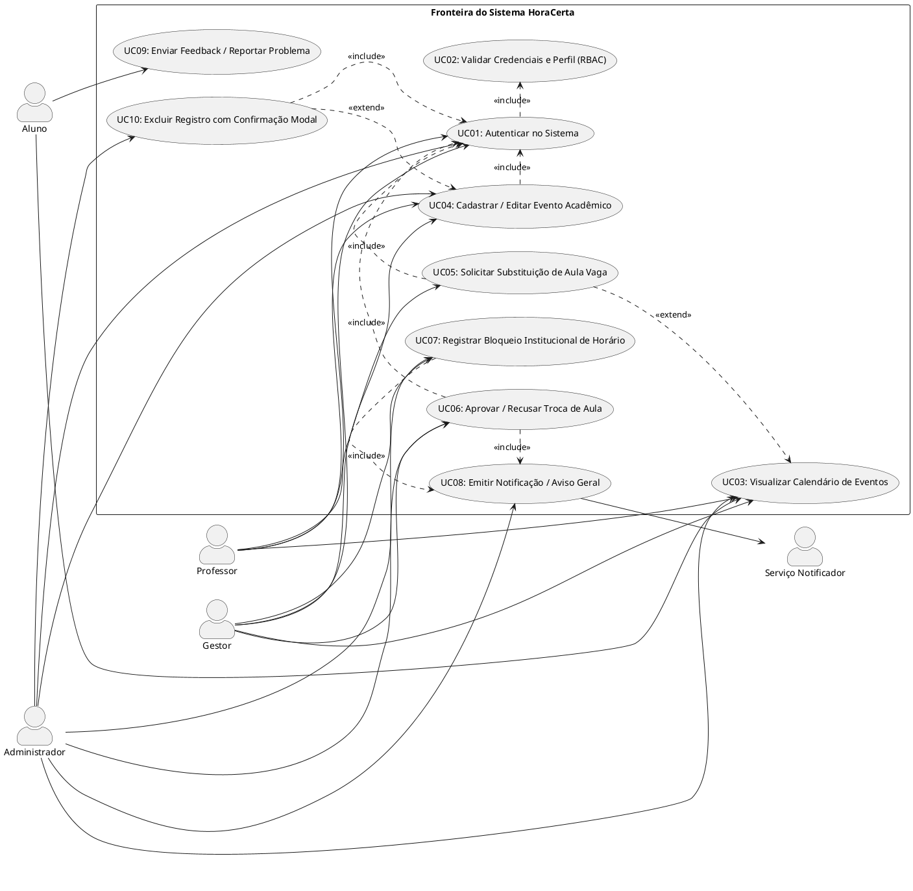
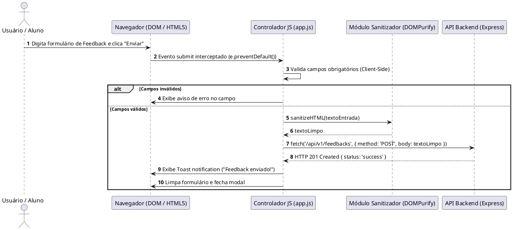
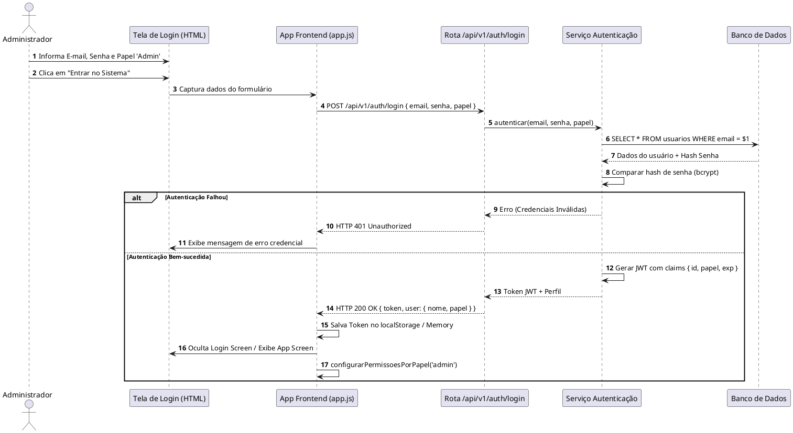
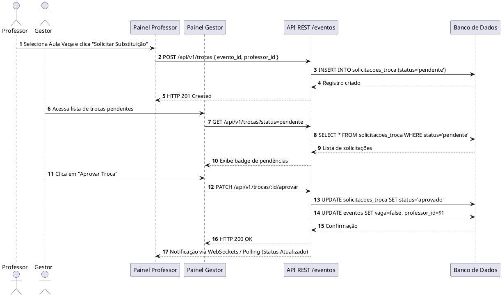
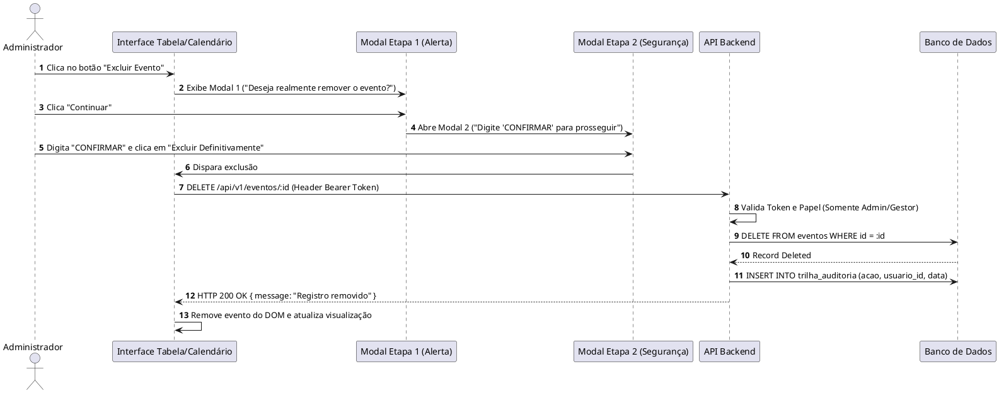

# Especificação de Requisitos de Usuário (RU)
**Sistema:** HoraCerta — Gestão Escolar e Calendário de Eventos
**Padrão:** ISO/IEC/IEEE 29148:2018 | UML 2.5.1
**Versão:** 1.0
**Data:** 08/09/2026

---

## 1. Identificação e Caracterização Formal dos Atores (UML 2.5.1)

Conforme a especificação OMG UML 2.5.1, os atores representam papéis desempenhados por entidades externas (humanos ou sistemas) que interagem diretamente com a fronteira do sistema (*System Boundary*).

### 1.1 Atores Humanos Primários
- **`[ACT-01] Aluno`**: Usuário final do corpo discente.
  - *Descrição*: Acessa o sistema para visualizar horários, provas, trabalhos e avisos da coordenação. Pode emitir relatórios de problemas ou sugestões via formulário de feedback.
  - *Privilégios*: Somente leitura na grade de eventos; criação de registros de feedback.
- **`[ACT-02] Professor`**: Usuário final do corpo docente.
  - *Descrição*: Responsável por ministrar aulas. Acessa o sistema para visualizar a grade, cadastrar e alterar datas de avaliações, trabalhos e tarefas, além de solicitar a alocação/substituição de aulas marcadas como vagas.
  - *Privilégios*: Leitura geral; leitura/escrita em eventos de suas turmas; solicitação de trocas de aula.
- **`[ACT-03] Gestor (Coordenação / Direção)`**: Usuário com poder decisório operacional.
  - *Descrição*: Gerencia a alocação de salas, autoriza a substituição de aulas vagas por professores, cadastra atividades institucionais (ex.: eventos na quadra que bloqueiam horários) e emite avisos globais.
  - *Privilégios*: Leitura/escrita total em eventos; aprovação de solicitações de troca; gestão de bloqueios de horário.
- **`[ACT-04] Administrador (Admin)`**: Operador técnico da plataforma.
  - *Descrição*: Responsável pela manutenção do ambiente, gerenciamento de usuários, configuração de parâmetros globais, auditoria e emissão de avisos de manutenção/emergência.
  - *Privilégios*: Acesso total (*Superuser*) a todas as entidades e operações de CRUD do sistema.

### 1.2 Atores Sistêmicos Secundários
- **`[ACT-50] Sistema de Banco de Dados (PostgreSQL/SQLite)`**: Entidade persistente.
  - *Descrição*: Armazena os dados de autenticação, eventos, solicitações de troca, notificações e registros de auditoria com garantia das propriedades ACID.
- **`[ACT-51] Serviço Notificador (E-mail / Web Push)`**: Serviço secundário assíncrono.
  - *Descrição*: Dispara alertas e notificações em tempo real para alunos e professores quando ocorrem alterações de última hora no calendário.

---

## 2. Diagrama de Casos de Uso (UML 2.5.1)



---

## 3. Catálogo Detalhado de Requisitos de Usuário (RU)

### `RU-01`: Autenticação e Seleção de Perfil (Login)
- **Caso de Uso Associado**: `UC01` / `UC02`
- **Ator Principal**: `Prof`, `Gestor`, `Admin`, `Aluno`
- **Prioridade (MoSCoW)**: Must Have (Obrigatório)
- **Pré-condições**: Usuário com cadastro prévio e conexão com o servidor.
- **Fluxo Operacional Paso a Passo**:
  1. O usuário acessa a página inicial do HoraCerta.
  2. O sistema exibe o formulário de login exigindo *Identificação/E-mail* e a *Seleção de Papel* (`Aluno`, `Professor`, `Gestor`, `Admin`).
  3. O usuário preenche as credenciais e clica em "Entrar no Sistema".
  4. O frontend envia a requisição de autenticação para o backend.
  5. O backend valida os dados, gera o token de sessão/JWT e retorna o perfil do usuário.
  6. O frontend armazena a sessão e ajusta a interface conforme as permissões do perfil selecionado.
- **Pós-condições**: O usuário obtém acesso à interface personalizada com seu nível de privilégio configurado.

### `RU-02`: Visualização Personalizada e Filtragem do Calendário
- **Caso de Uso Associado**: `UC03`
- **Ator Principal**: `Aluno`, `Prof`, `Gestor`, `Admin`
- **Prioridade (MoSCoW)**: Must Have
- **Pré-condições**: Nenhuma (acesso público para visualização basilar).
- **Fluxo Operacional Paso a Passo**:
  1. O usuário acessa a tela do calendário.
  2. O sistema carrega os eventos do mês corrente.
  3. O usuário altera o modo de exibição alternando entre as abas "Mês" e "Semana".
  4. O usuário marca/desmarca as caixas de seleção de categorias (*Aula*, *Prova/Trabalho*, *Feriado*, *Evento Escolar*).
  5. O calendário atualiza instantaneamente a renderização no DOM, exibindo ou ocultando os blocos correspondentes.
- **Pós-condições**: Apenas os eventos pertencentes às categorias selecionadas e ao intervalo temporal escolhido são exibidos.

### `RU-03`: Cadastro e Edição de Avaliações e Trabalhos
- **Caso de Uso Associado**: `UC04`
- **Ator Principal**: `Prof`, `Gestor`, `Admin`
- **Prioridade (MoSCoW)**: Must Have
- **Pré-condições**: Ator autenticado com papel `Professor`, `Gestor` ou `Admin`.
- **Fluxo Operacional Passo a Passo**:
  1. O ator clica no botão "+ Novo Evento / Prova".
  2. O sistema exibe uma janela modal com o formulário de cadastro.
  3. O ator preenche o título, disciplina, turma, tipo de evento (*Prova*, *Trabalho*, *Aula*), data e horário.
  4. O ator confirma o envio clicando em "Salvar Evento".
  5. O frontend valida os campos client-side e envia os dados via HTTP POST/PUT.
  6. O backend armazena o evento e responde com status `201 Created` / `200 OK`.
  7. A interface adiciona o novo evento à grade do calendário e exibe notificação Toast de sucesso.
- **Pós-condições**: O evento é salvo no banco de dados e publicado no calendário para alunos e professores da turma.

### `RU-04`: Solicitação de Preenchimento de Aula Vaga
- **Caso de Uso Associado**: `UC05`
- **Ator Principal**: `Prof`
- **Prioridade (MoSCoW)**: Should Have (Desejável)
- **Pré-condições**: Existência de uma aula cadastrada com a flag `vaga = true` no sistema.
- **Fluxo Operacional Passo a Passo**:
  1. O professor visualiza um bloco de aula marcado como "AULA VAGA" no calendário.
  2. O professor clica sobre o evento ou no botão "Pegar Aula Vaga".
  3. O sistema exibe um modal confirmando os detalhes do horário e da turma.
  4. O professor clica em "Enviar Solicitação para Gestor".
  5. O sistema registra uma solicitação com status `pendente` associada ao ID do evento e do professor solicitante.
- **Pós-condições**: Solicitação encaminhada para a fila de deliberação da Coordenação/Gestão.

### `RU-05`: Homologação e Confirmação de Substituição de Aula
- **Caso de Uso Associado**: `UC06` / `UC08`
- **Ator Principal**: `Gestor`, `Admin`
- **Prioridade (MoSCoW)**: Must Have
- **Pré-condições**: Existência de pelo menos uma solicitação de troca com status `pendente`.
- **Fluxo Operacional Passo a Passo**:
  1. O gestor clica no botão "Aprovar Trocas" no painel lateral.
  2. O sistema exibe a lista de solicitações pendentes com nome do professor, disciplina e horário.
  3. O gestor avalia a requisição e clica em "Aprovar" ou "Recusar".
  4. Em caso de aprovação, o backend atualiza o evento atribuindo o novo professor, desmarca a flag `vaga` para `false` e altera a solicitação para `aprovado`.
  5. O sistema emite automaticamente um aviso geral e notificação para a turma e para o professor.
- **Pós-condições**: A aula é oficialmente reatribuída e os alunos são notificados sobre o preenchimento do horário.

### `RU-06`: Bloqueio Institucional de Horário (Atividade na Quadra/Evento)
- **Caso de Uso Associado**: `UC07` / `UC08`
- **Ator Principal**: `Gestor`, `Admin`
- **Prioridade (MoSCoW)**: Must Have
- **Pré-condições**: Autenticação como Gestor ou Admin.
- **Fluxo Operacional Passo a Passo**:
  1. O gestor aciona o botão "Bloquear Horário (Ex: Quadra)".
  2. O formulário abre solicitando: *Local/Motivo*, *Data*, *Horários Afetados* e *Turmas Envolvidas*.
  3. O gestor confirma a operação.
  4. O sistema cria um evento do tipo `atividade_escolar` sobrescrevendo ou cancelando as aulas normais daquele intervalo.
  5. É inserido um banner de aviso no topo da tela e enviado alerta para professores e alunos afetados.
- **Pós-condições**: Horários normais bloqueados e banner de aviso publicado no topo do calendário.

### `RU-07`: Envio de Feedback e Relato de Problemas pelo Aluno
- **Caso de Uso Associado**: `UC09`
- **Ator Principal**: `Aluno`
- **Prioridade (MoSCoW)**: Could Have (Opcional)
- **Pré-condições**: Acesso do aluno à plataforma.
- **Fluxo Operacional Passo a Passo**:
  1. O aluno clica no botão "Reportar Problema / Sugestão".
  2. O sistema abre o modal com campos: *Tipo de Relato* (`Problema no Horário` / `Sugestão`) e *Descrição*.
  3. O aluno digita a mensagem e clica em "Enviar Feedback".
  4. O frontend valida o texto e submete via requisição assíncrona POST.
  5. O sistema registra o feedback no banco de dados e exibe mensagem de confirmação.
- **Pós-condições**: Registro armazenado na tabela de feedbacks para análise do Administrador.

### `RU-08`: Exclusão Segura de Eventos com Confirmação em Duas Etapas
- **Caso de Uso Associado**: `UC10`
- **Ator Principal**: `Admin`, `Gestor`
- **Prioridade (MoSCoW)**: Must Have
- **Pré-condições**: Usuário com privilégios administrativos; evento existente.
- **Fluxo Operacional Passo a Passo**:
  1. O ator clica no ícone de exclusão (ou opção dentro do modal de detalhes do evento).
  2. O sistema abre uma primeira caixa modal de alerta: *"Deseja realmente remover este evento?"*.
  3. O ator clica em "Confirmar Exclusão".
  4. O sistema solicita uma segunda confirmação ou validação de segurança (segunda etapa).
  5. Após confirmação definitiva, o frontend dispara a requisição `DELETE` para o backend.
  6. O backend remove o registro e grava o histórico na trilha de auditoria.
- **Pós-condições**: Evento removido do banco e do calendário; ação registrada na auditoria.

---

## 4. Histórias de Usuário e Critérios de Aceite (BDD / Gherkin)

```gherkin
# US-01: Autenticação de Usuários
Funcionalidade: Autenticação e Controle de Acesso Baseado em Papéis
  Como um usuário da comunidade escolar (Aluno, Professor, Gestor, Admin)
  Quero me autenticar informando minha identificação e selecionando meu papel
  Para acessar as funcionalidades específicas permitidas ao meu perfil.

  Cenário: Login bem-sucedido como Professor
    Dado que o professor está na tela de login
    E preenche a identificação com "Prof. Carlos"
    E seleciona o papel "Professor"
    Quando ele clicar no botão "Entrar no Sistema"
    Então o sistema deve autenticar o usuário com sucesso
    E deve exibir a badge com o papel "Professor" no topo
    E deve disponibilizar os botões "+ Novo Evento / Prova" e "Pegar Aula Vaga" na barra lateral.

  Cenário: Tentativa de login sem informar identificação
    Dado que o usuário está na tela de login
    E deixa o campo de identificação em branco
    Quando ele clicar no botão "Entrar no Sistema"
    Então o sistema deve bloquear o envio do formulário
    E deve exibir uma mensagem de validação client-side no campo correspondente.

# US-02: Filtro Dinâmico de Categorias
Funcionalidade: Filtragem de Eventos do Calendário
  Como um aluno ou professor
  Quero marcar ou desmarcar as categorias de eventos na barra lateral
  Para visualizar apenas os compromissos do meu interesse no calendário.

  Cenário: Desmarcar categoria de Aulas
    Dado que o usuário está visualizando o calendário com todas as categorias marcadas
    Quando ele desmarcar a checkbox "Aula"
    Então todos os eventos da categoria "aula" devem desaparecer imediatamente do calendário
    E os eventos de "Prova / Trabalho", "Feriado" e "Evento Escolar" devem permanecer visíveis.

# US-03: Solicitação de Substituição de Aula Vaga
Funcionalidade: Solicitação de Aula Vaga por Professor
  Como um professor disponível
  Quero solicitar a substituição de uma aula vaga
  Para que a coordenação possa autorizar meu preenchimento do horário.

  Cenário: Solicitação enviada com sucesso
    Dado que existe uma aula vaga de "História" no dia 25/08
    E o professor "Prof. Marcos" está autenticado no sistema
    Quando ele clicar sobre o evento de aula vaga
    E confirmar o envio no modal de solicitação
    Então o sistema deve registrar a solicitação com status "pendente"
    E deve exibir uma notificação Toast "Solicitação enviada com sucesso!".

# US-04: Homologação de Troca pela Gestão
Funcionalidade: Homologação de Substituição pela Coordenação
  Como um Gestor escolar
  Quero aprovar solicitações de substituição de aula
  Para que a grade oficial seja atualizada e a turma seja avisada.

  Cenário: Aprovação de substituição pelo gestor
    Dado que existe uma solicitação pendente do "Prof. Marcos" para a aula vaga do dia 25/08
    E o usuário está autenticado como "Gestor"
    Quando ele acessar a lista de trocas e clicar no botão "Aprovar"
    Então o status da solicitação deve mudar para "aprovado"
    E o evento deve deixar de ser exibido como "AULA VAGA" no calendário
    E um aviso público deve ser gerado alertando os alunos sobre a confirmação da aula.
```

---

## 5. Diagramas de Sequência Orientados ao Usuário (PlantUML)

### 5.1 DS-01: Validação Client-Side, Sanitização Assíncrona e Feedback DOM



### 5.2 DS-02: Fluxo de Login Administrativo com Sessão / JWT



### 5.3 DS-03: Alteração Operacional de Status de Atendimento / Aula



### 5.4 DS-04: Exclusão Segura de Registros com Confirmação Modal em 2 Etapas


